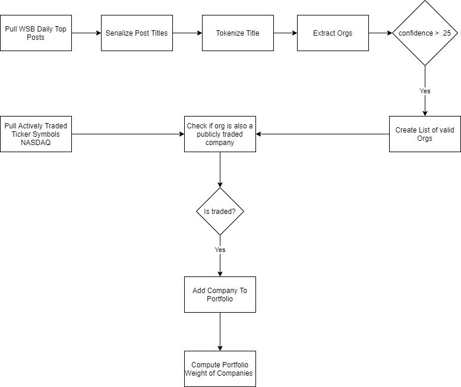

# Tendie-Factory

## About

Tendie-Factory is a work in progress application that seeks to track the stocks mentioned in the `wallstreetbets` subreddit.

## Quickstart

To run this program:

1. Install [Rust](https://www.rust-lang.org/tools/install)
2. From the `tendie-factory/core` directory run: `cargo run`.
3. Look at the portfolio allocations in ``portfolio.json``

## Goals of the project

1. Create a portfolio of stocks based on the past 24 hours of data derived from `wallstreetbets`.
2. Determine if any of the stocks in the portfolio need to be rotated.
3. Automate the trading of these stocks via an API.
4. Profit!

## Current Behavior

Currently, the following algorithm is followed:

1. Pull the data from [WSB](https://www.reddit.com/r/wallstreetbets) top posts over the past day.
2. Use the [Named Entity Recognition Model](https://en.wikipedia.org/wiki/Named-entity_recognition) and Actively traded ticker symbols to parse out valid Tickers.
3. For Tickers that are mentioned, construct a portfolio of stock weights with `(Mentions / Total Mentions)`.
The program will output a JSON object with the Tickers and respective weights, for example:

```json
[{"meta":{"symbol":"F","company_name":"Ford Motor Company Common Stock","last_sale":"$10.53","net_change":"-0.19","net_percent_change":"-1.772%","market_capitalization":"41892840101.00","country":"United States","ipo_year":"","volume":"73793177","sector":"Capital Goods","industry":"Auto Manufacturing"},"portfolio_weight":0.06666666666666667},{"meta":{"symbol":"GME","company_name":"GameStop Corporation Common Stock","last_sale":"$325.00","net_change":"131.40","net_percent_change":"67.872%","market_capitalization":"22667762000.00","country":"United States","ipo_year":"2002","volume":"50232204","sector":"Consumer Services","industry":"Electronics Distribution"},"portfolio_weight":0.5333333333333333},{"meta":{"symbol":"AMC","company_name":"AMC Entertainment Holdings Inc. Class A Common Stock","last_sale":"$13.26","net_change":"4.63","net_percent_change":"53.65%","market_capitalization":"4496112515.00","country":"","ipo_year":"2013","volume":"597863464","sector":"Consumer Services","industry":"Movies/Entertainment"},"portfolio_weight":0.2},{"meta":{"symbol":"BB","company_name":"BlackBerry Limited Common Stock","last_sale":"$14.10","net_change":"-0.55","net_percent_change":"-3.754%","market_capitalization":"7933140697.00","country":"Canada","ipo_year":"","volume":"93646479","sector":"Technology","industry":"Computer Software: Prepackaged Software"},"portfolio_weight":0.13333333333333333},{"meta":{"symbol":"SCHW","company_name":"Charles Schwab Corporation (The) Common Stock","last_sale":"$51.54","net_change":"-2.20","net_percent_change":"-4.094%","market_capitalization":"96847658525.00","country":"United States","ipo_year":"","volume":"17770980","sector":"Finance","industry":"Investment Bankers/Brokers/Service"},"portfolio_weight":0.06666666666666667}]
```

### Flow Diagram



## Citations

```bibtex
@inproceedings{becquin-2020-end,
    title = "End-to-end {NLP} Pipelines in Rust",
    author = "Becquin, Guillaume",
    booktitle = "Proceedings of Second Workshop for NLP Open Source Software (NLP-OSS)",
    year = "2020",
    publisher = "Association for Computational Linguistics",
    url = "https://www.aclweb.org/anthology/2020.nlposs-1.4",
    pages = "20--25",
}
```